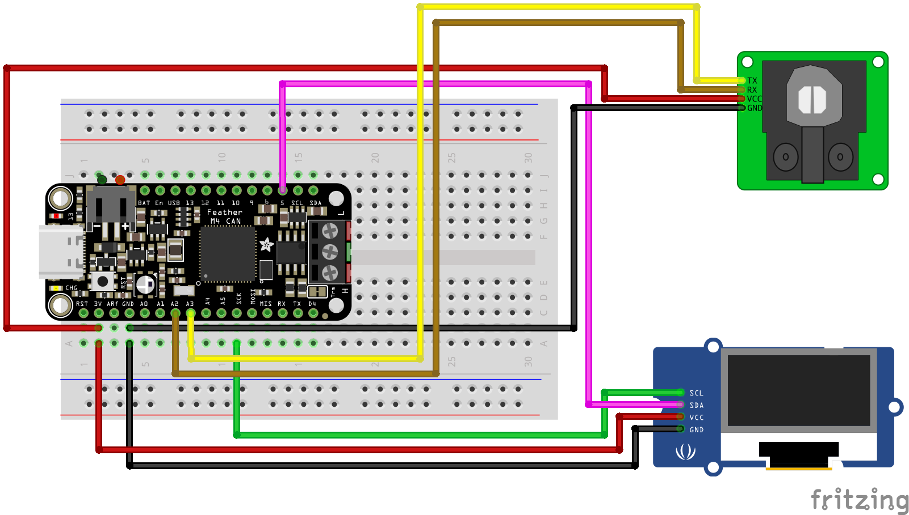

# YDLIDAR GS2 Demo

The [YDLIDAR GS2](https://www.ydlidar.com/products/view/11.html) is a small solid state lidar, typically used by robot vacuum. It hasa range of 25-300mm and will give 160 distance readings over a 100° field of view.

This repository include a small demo that uses a Adafruit Feather M4 CAN Express  (ATSAME51) with a small OLED to display distance readings.

## Compatibility

The library code for interfacing with the lidar [`ydlidar-gs2.cpp`](./src/ydlidar-gs2-demo/ydlidar-gs2.cpp) should work on any Arduino board. The demo itself will likely need modification if run on anything other than a Feather M4 CAN, this is mostly due to the use of non-default serial and i2c comms.

## Hookup guide
Following diagram is for the code as per this repository.

# Running
Using the Arduino IDE app open the ino file found in the `src/ydlidar-gs2-demo` folder. Build and upload to device.

All dependencies (OLED lib) needed by this demo have been included in this repo.
